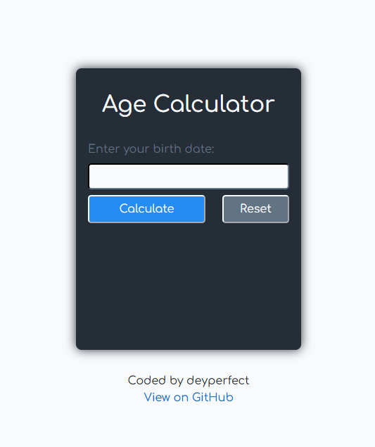

# Age Calculator

A web-based age calculator built as part of the [roadmap.sh Age Calculator Project](https://roadmap.sh/projects/age-calculator). This project demonstrates the use of external NPM packages, DOM manipulation, and date handling in JavaScript.



## Project Overview

This project is a solution to the roadmap.sh beginner-level frontend challenge. It calculates a user's exact age based on their birthdate, utilizing modern JavaScript libraries and tools.

**Live Demo (GitHub Pages):** [https://deyperfect.github.io/age-calculator/](https://deyperfect.github.io/age-calculator/)

**Live Demo (Amazon S3):** [http://deyperfect-age-calculator.s3-website-ap-southeast-2.amazonaws.com/](http://deyperfect-age-calculator.s3-website-ap-southeast-2.amazonaws.com/)

### Project Requirements

This project implements the following requirements from the roadmap.sh challenge:

✅ Form with JavaScript datepicker for birthdate input  
✅ Integration with Luxon library for precise age calculation  
✅ Display of exact age in years, months, and days  
✅ Form validation to ensure valid birthdate input  
✅ Responsive and visually appealing design  
✅ Result displayed on the same page after form submission

## Features

- Calculate exact age in years, months, and days
- JavaScript datepicker for birthdate input 
- Powered by Luxon for accurate date calculations
- Form validation to ensure valid birthdates
- Clean, responsive, and visually appealing UI
- Mobile-friendly interface

## Deployment

This project has been deployed using both GitHub Pages and Amazon S3 Static Website Hosting to compare deployment workflows and gain hands-on experience with AWS cloud services.

| Platform | Purpose |
|----------|---------|
| GitHub Pages | Initial deployment for frontend hosting |
| Amazon S3 Static Website Hosting | Hands-on AWS cloud deployment and configuration |

### AWS Skills Demonstrated

- Amazon S3 Bucket creation
- Static Website Hosting
- Bucket Policy configuration
- Public Access configuration
- Production build deployment using Vite
- Browser console debugging
- Deployment troubleshooting

## Technologies Used

- **HTML** - Structure and content
- **CSS** - Styling and layout
- **JavaScript** - Age calculation logic and DOM manipulation
- **Vite** - Build tool and development server
- **[Luxon](https://www.npmjs.com/package/luxon)** - Date and time manipulation library
- **[js-datepicker](https://www.npmjs.com/package/js-datepicker)** - JavaScript datepicker component

## Challenges and Solutions

### Challenge 1 – JavaScript Dependencies Failed After Deployment

**Problem**

The application loaded successfully, but the JavaScript date picker failed to initialize.

**Root Cause**

The project was deployed using the source files instead of the production build generated by Vite. Because the application depended on npm packages, Amazon S3 could not resolve those dependencies at runtime.

**Solution**

Generated a production build using ```npm run build``` and deployed the generated dist folder instead.

### Challenge 2 – Static Assets Returned 404 Errors

**Problem**

After deployment, CSS and JavaScript files returned 404 errors. The issue was identified by inspecting the browser's Developer Tools Console, which reported 404 errors for the generated CSS and JavaScript assets.

**Root Cause**

The Vite project was configured for GitHub Pages which generated incorrect asset paths for Amazon S3:
```js
base: "/age-calculator/"
```

**Solution**

Updated the configuration to 
```js 
base: "/"
```
rebuilt the project, and redeployed the production files.

## What I Learned

This project helped me gain practical experience in:

- Working with external npm packages
- Using Luxon for date manipulation
- Creating responsive interfaces
- Building production-ready applications with Vite
- Deploying static websites using Amazon S3
- Configuring S3 Bucket Policies and Static Website Hosting
- Debugging deployment issues using browser developer tools
- Understanding how build configuration affects production deployments

This project also reinforced the importance of understanding how build tools and deployment environments interact, particularly when deploying the same application across different hosting platforms.

## Installation

1. Clone the repository:
```bash
git clone https://github.com/deyperfect/age-calculator.git
```

2. Install dependencies:
```bash
npm install
```

### Running the Application

Start the development server:
```bash
npm run dev
```

## Usage

1. Open the application in your web browser
2. Click on the date input field to open the JavaScript datepicker
3. Select your date of birth from the calendar
4. Click the "Calculate" button
5. View your exact age displayed in years, months, and days

## Author

**deyperfect**
- GitHub: [@deyperfect](https://github.com/deyperfect)

